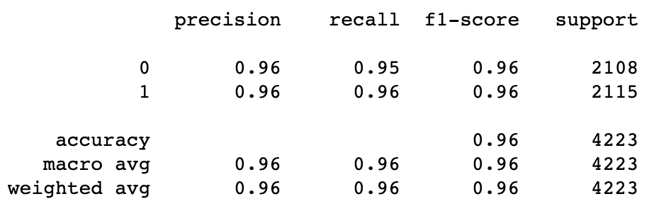
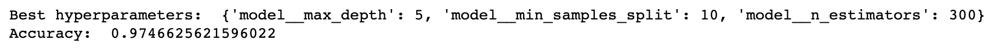

# League Of Legends Model Building
This is a project for DSC 80 at UCSD by Joanne Pon and Justin Huang

# Our exploratory data analysis on this dataset can be found on the website:
[Websites] (https://jnhuang02.github.io/League-of-Legends/)
---

## Framing the Problem

We want to predict the result of whether the team will win or lose in the game. This will be a binary classification, since we are predict wheter win or lose. The response variable is the result column, which states whatever a team wins or not in binary form. 1 means win, 0 means loss. The metrics we use is precision, recall, and f1-score. We chose these metrics, because recall illustrates a model's ability to predict the positive instances correctly. In this case, it illustrates how many games are won or lost correctly. Precision shows how accurate it is at identifying positive results, or in this case how well it can predict games were won. F1 score combines both and shows the overall accuracy of the binary classification prediction.

---

## Baseline Model

We take in two columns, teamkills and teandeaths, which are both quantitative datas. These two columns represent the kills and deaths in the game. We want to use teamkills and teamdeaths to predict the result column by using ColumnTransformer and Stdscaler to build our Pipeline to help standardize. As seen in the model below, we have a high weighted average at 0.96. This is a good sign as that is relatively high and close to perfection.

---

## Final Model:
Describe the modeling algorithm you chose, the hyperparameters that ended up performing the best, and the method you used to select hyperparameters and your overall model. Describe how your Final Model’s performance is an improvement over your Baseline Model’s performance.

We added two features, which is gold per minute and number of towers destroyed per each game. We believe that adding these two values will increase the accuracy, since gold per minute represents the how well the teams obtain gold, which is crucial to buying items and winning the game. We believe that the higher the value in the total gold, the more the team will win in the game. Adding this feature, we think that can help us prdict the win or lose by considering the amount of gold the team have. Another feature is number of towers destroyed per game, which is a nominal variable. It indicates the total number of towers that were destroyed per game. This feature is important because towers are crucial for defending and nexus, and more towers destroyed means the enemy team are inching closer towards the nexus and thus victory. Therefore, we believe that the number of towers destroyed are a good factor in indicating whatever or not a team has won the game.

The method that we chose is a random forest classifier, and we use a grid search cross validation to find the best hyperparameters that will best fit the data. Although this may take longer than compared to other cross validation methods, it does produce the most reliable results. As seen in the results below, the best hyperparameters are for the max depth of the model 5, minimum number of samples to split, 10, and 300 for the number of n estimators. The accuracy has improve slightly, jumpying from a 96 to a 97.5 percent.

---

## Fairness Analysis:

Our GroupX is teams with the amount of gold earned per minute higher than the median, and GroupY is the team that has the amount of gold per minute below the median.

Evalutation Matrix: Precision for whatever or not a team has won

Our null hypothesesis: There is no difference in precision for group X and group Y.

Our Alternative Hypothesis: There will be a significiant difference between group X and group Y.

Test statistic: The precision difference between group x and group y

significant level: 0.05

Observed Precision Difference:  -0.051627516186341316

Null hypothesis is rejected, p value is :  0.018

Conclusion: The p-value is less than the significant value, which rejects the null hypothesis.
